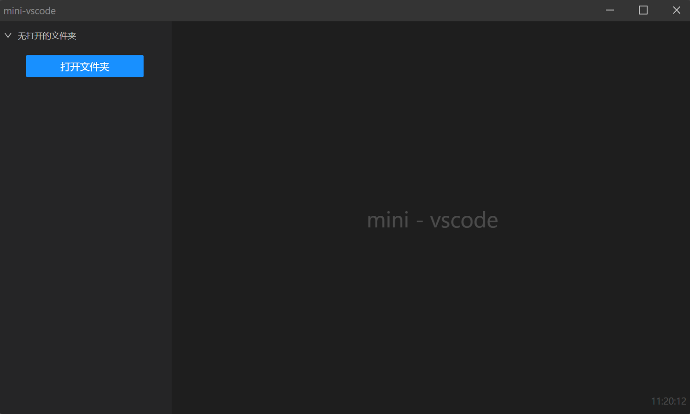
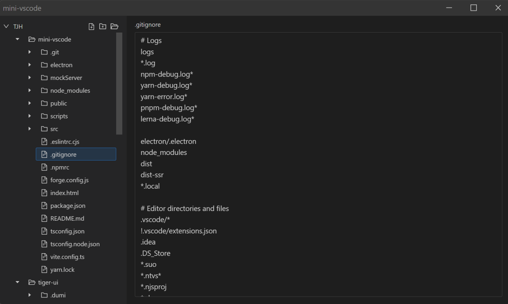

# Electron + Vite + React + React-Router + Less

一个 electron 示例项目。支持本地开发模式、打包模式。

## 一、运行
```shell
# 安装
yarn

# 运行
yarn dev

# 构建
yarn build

# 预览
yarn preview

```
## 二、项目展示



## 三、演示功能
- 读取文件
- 保存文件
- 缓存文件（未保存）
- 自定义顶部菜单栏
  
## 四、项目工程
- 开发（即时预览效果）
- 预览（预览打包后效果）
- 构建